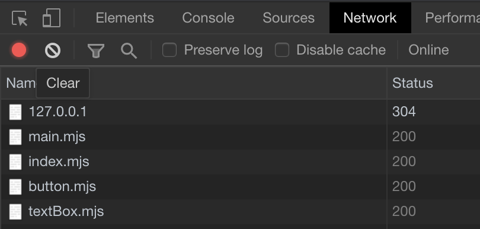

# Modular JavaScript Named Exports (No Tree Shaking)

The purpose of this demo is to show that the browser does not tree-shake when importing modules. This is not a huge surprise, though it would have been nice to have the browser tree-shake just-in-time.

`/modules/elements/index.mjs`

```js
export {default as button} from './button/button.mjs';
export {default as textBox} from './textBox/textBox.mjs';
```

`/modules/main.js`

```js
import { button } from "./elements/index.mjs";
console.log(button);
```

Ideally, because I am only importing the button component into `main.js`, I would want the browser to evaluate `/modules/elements/index.mjs` and only import the file being used.

Unfortunately `textBox.js` comes along for the ride.

